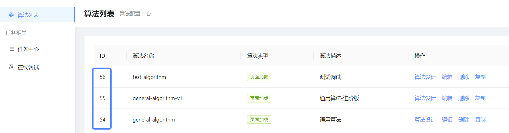

### 1.环境要求(重要)


- 1.requirements.txt（Python所依赖安装）

- 2.ADB(桥接程序和手机进行通信的用于选中app，点击屏幕和录屏)  
**如果不用该工程进行录屏。只是用于上传，可以略过Adb安装**

    关于Windows ADB:  
    需要添加到环境变量里面。   

    关于macOS ADB:   
    步骤一：安装homebrew
  ```
  ruby -e "$(curl -fsSL https://raw.githubusercontent.com/Homebrew/install/master/install)"  
  ```
  步骤二：安装adb  
  ```
  brew cask install android-platform-tools
  ```
  启动检查adb：adb devices

### 2.工程使用介绍
不用安装，Python工程调用使用，start_up.py

**2.1 自定义调用示例**
- 初始化鉴权不可缺少
- 视频录制、任务生成、结果查询自行组装
```python
# 
    # 初始化鉴权，app_text用于指定点击的文本元素
    sdk = SmartPerfSdk(app_key="o7oVfy1c", app_secret="4b82840cfe138c44d80f527eba6e17c2", app_text="叮当快药")
    # 根据当前窗口xml，查找app_text内容，并进行点击
    # sdk.start_app()
    # sdk.start_app 这里会自根据默认路径，自生成视频文件,
    # 如果想使用自己录制的视频，可以跳过sdk.start_app()定义视频文件路径
    video_path = "e://A.mp4"
    sdk.crate_task(video_path, 41)
    sdk.get_task_report()
```
平台上查询的算法ID 可以见下图

**2.2 标准调用示例**  
- 执行脚本前，需定位到录制页面
- 系统会自动查找app_text文本元素，然后进行自动点击、录制
- 将录制好的视频，上传至云服务，自动解析
- 每次启动会删除之前的视频，确保视频是最新的一次
```python
# 标准调用试例
sdk = SmartPerfSdk(app_key="o7oVfy1c", app_secret="4b82840cfe138c44d80f527eba6e17c2", app_text="叮当快药")
sdk.start_app()
sdk.start_record_and_upload_oss(algorithm_id='41')
```
在start_up.py里面需要填入参数的只有上面5个。  
app_key和app_secret可以寻找负责对接同事获得，后续会在平台页面上可供查，目前只需要填入一次。  
app_text='飞书'是目前要测试的APP名称，滑动到手机屏幕要测试的App页面，这个app_text同app icon下方的名称。  
algorithm_id位置下图中可以查询到。  
  

### 录屏装饰器(后续提供)
@record装饰器 装饰在操作步骤的case上面  
- platform - 安卓/iOS可缩写为：a/i
- file_path - 录屏视频的文件路径，存为mp4格式
- offset - tuple类型，tuple[0]表示录屏开始后，在case开始前等待几秒。tuple[2]case执行等待几秒后结束

